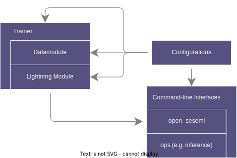
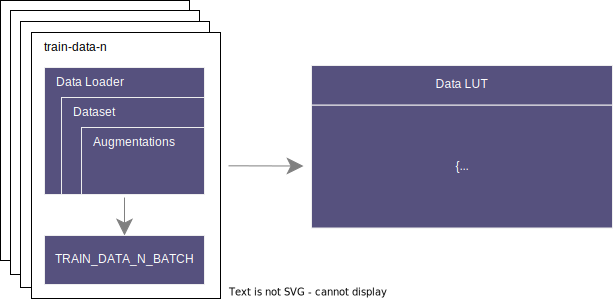
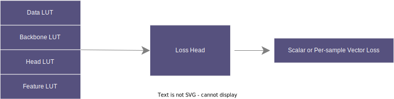

========
Overview
========

This document provides a high-level description of SESEMI. Key components are outlined
and some of the motivations for the design are elaborated. More detail is provided in
later sections, particularly within the tutorials.

--------
Audience
--------

We targeted the development of SESEMI towards the following audiences:

* Machine Learning practitioners looking to rapidly utilize unlabeled data for their image classification problems.
* Researchers aiming to experiment quickly with novel methods for learning with limited labeled data.

To this end, we have designed this library to support a gamut of research ideas while
making it possible to apply them on different kinds of classification datasets using a shared
interface.

-------------
Prerequisites
-------------

To use SESEMI effectively, you should have the following background:

* Familiar with Python, YAML, and the basics of invoking command-line programs.
* Aware of how data is loaded, models are defined, and losses are optimized in PyTorch and in some capacity PyTorch Lightning.
* Understand the fundamental concepts of self-supervised and semi-supervised learning.

------
System
------

The following diagram illustrates the main components within SESEMI:

    
    SESEMI Component Diagram

Below, we briefly explain each of the components further. Note that there is a clear separation between the data loading pipeline defined by the datamodule
and the models and optimizer defined by the lightning module. This distinction between the data and models makes it possible to flexibly specify
data pipelines that can be utilized in numerous different ways by the models.

^^^^^^^^^^
Datamodule
^^^^^^^^^^

To define our data pipelines, we use PyTorch Lightning's Datamodule API. We support datasets that can be split into
training, validation, and optionally test subsets. As during training you will often want to have access to multiple
different kinds of data pipelines (e.g. one for labeled data and another for unlabeled data),
we support defining a number of named data loaders whose data batches are exposed via a
lookup table (LUT) during training. This is illustrated by the following diagrams:

    
    Training Data Pipeline

For validation and testing, however, we instead simply expect a single standard data loader yielding images and associated
classification labels.

^^^^^^^^^^^^^^^^
Lightning Module
^^^^^^^^^^^^^^^^

The LightningModule is composed of models and a single global optimizer. The models themselves are decomposed into the following:

* A supervised backbone.
* A supervised head.
* An optional exponentially averaged supervised backbone.
* An optional exponentially averaged supervised head.
* Additional models defined by regularization loss heads over either labeled and/or unlabeled data.

Similar to the training data loaders being named, we also name backbones and heads and expose them through
dictionaries (lookup tables).

The regularization loss heads use a specific API to define losses using lookup tables for the data, backbones,
heads, as well as model features. This is illustrated in the diagram below:
    

    
    Loss Head Inputs and Outputs

The losses are then accumulated alongside the supervised training loss and jointly optimized.
Our usage of lookup tables makes it possible to flexibly pass information throughout the pipeline
by configuring lookup keys rather than directly passing around the values.

^^^^^^^
Trainer
^^^^^^^

For training, we leverage Lightning's trainer API which has numerous features that you can learn about
from their extensive `documentation <https://pytorch-lightning.readthedocs.io/en/stable/common/trainer.html#trainer-class-api>`_.
We add a few tweaks that for example make it easier
to define a desired batch sizes per GPU independent of the acceleration method used for multi-GPU training
(e.g. DDP or DP).

^^^^^^^^^^^^^^
Configurations
^^^^^^^^^^^^^^

To support complex configurations, we rely on the Hydra configuration management system. It enables defining
configuration structures (i.e. schemas) for the various components of the system. The system components can
then be configured either through YAML files or via the command-line. A few of the many advantages of using Hydra
are:

* Variable interpolation in configurations.
* Configuration overrides when using files.
* Type-checking when using structured configurations.

Please see the the tutorials for details on how to configure SESEMI with Hydra.

.. raw:: html
    
    

^^^^^^^^^^^^^^^^^^^^^^^
Command-line Interfaces
^^^^^^^^^^^^^^^^^^^^^^^

We support command-line interfaces (CLIs) for training and evaluating models as well as for invoking various
different operations (ops). A benefit of using Hydra for configuration is that our CLIs are fully defined
by underlying structured configuration objects (i.e. schemas). For training and evaluation we expose
the `open_sesemi` command which will be elaborated on in subsequent tutorials. As a preview, the default
CLI configuration is shown below:

.. program-output:: open_sesemi --cfg job
